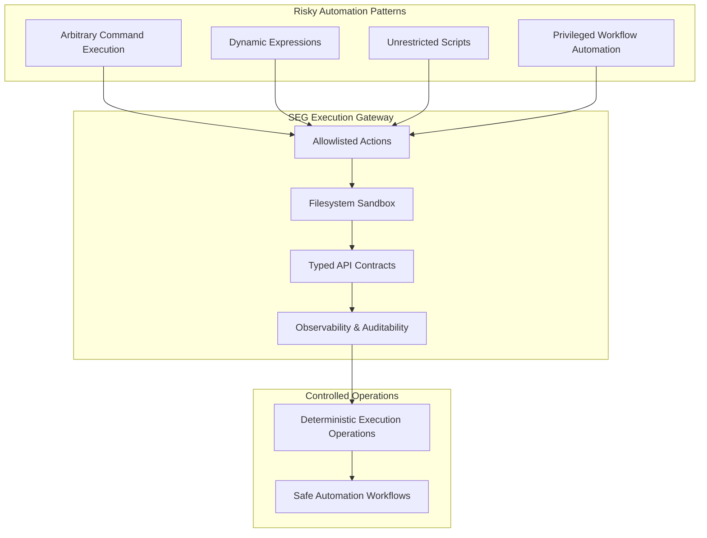
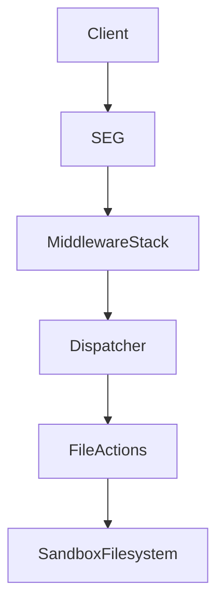
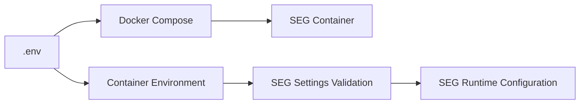
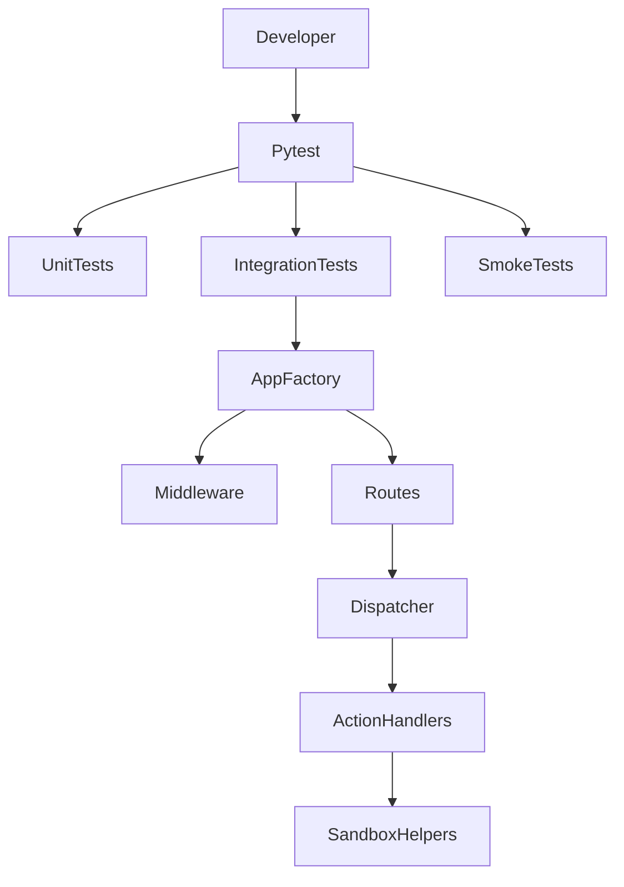
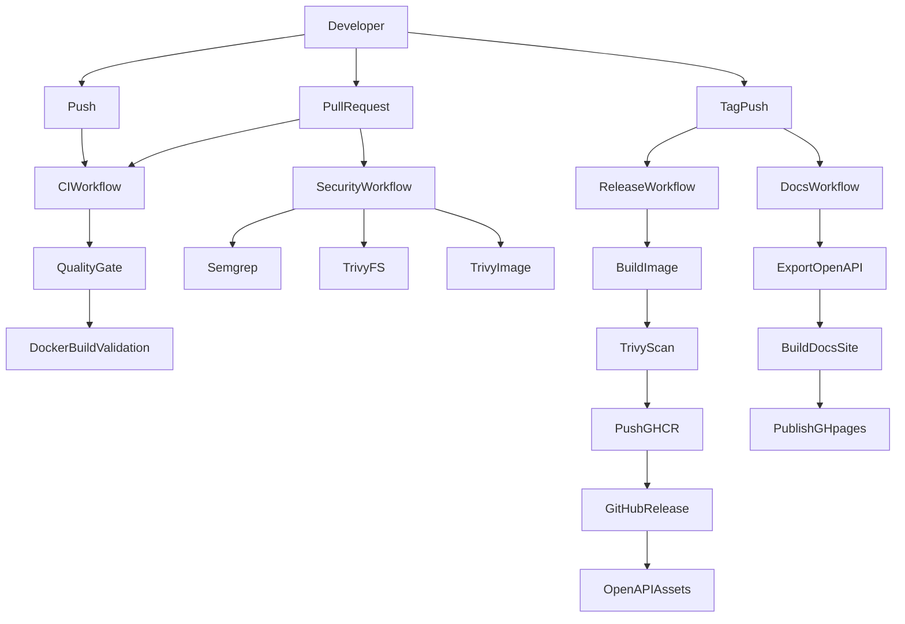

# Secure Execution Gateway (SEG)

<p align="center">
  <a href="https://github.com/libertocrat/seg/releases">
    
  </a>
  <a href="https://github.com/libertocrat/seg/blob/main/LICENSE">
    
  </a>
  <a href="https://github.com/libertocrat/seg/actions/workflows/ci.yml">
    
  </a>
  <a href="https://github.com/libertocrat/seg/actions/workflows/security.yml">
    
  </a>
  <a href="https://github.com/libertocrat/seg/actions/workflows/release.yml">
    
  </a>
  <a href="https://github.com/libertocrat/seg/pkgs/container/seg">
    
  </a>
  <a href="https://www.python.org/">
    
  </a>
  <a href="https://libertocrat.github.io/seg/api-docs/">
    
  </a>
</p>
<br>

A security-focused execution gateway for automation platforms that replaces arbitrary command execution with strictly allowlisted operations.

## Table of Contents

- [1. Overview](#1-overview)
- [2. Motivation](#2-motivation)
- [3. Key Features](#3-key-features)
- [4. Architecture Overview](#4-architecture-overview)
- [5. Security Model](#5-security-model)
- [6. Quick Start](#6-quick-start)
- [7. Configuration](#7-configuration)
- [8. API Overview](#8-api-overview)
- [9. Observability](#9-observability)
- [10. Project Structure](#10-project-structure)
- [11. Testing Strategy](#11-testing-strategy)
- [12. CI / DevSecOps](#12-ci--devsecops)
- [13. Documentation](#13-documentation)
- [14. Development](#14-development)
- [15. Contributing](#15-contributing)
- [16. Security Reporting](#16-security-reporting)
- [17. License](#17-license)

## 1. Overview

Secure Execution Gateway (SEG) is a security-focused FastAPI microservice that exposes a strictly allowlisted set of file operations inside a sandboxed container filesystem.

SEG acts as an internal execution gateway for automation and platform workflows that need controlled file handling without exposing arbitrary shell execution.

The service accepts HTTP requests, validates them through a defense-in-depth middleware stack, resolves a registered action from an explicit in-memory allowlist, and executes that action only inside a configured filesystem sandbox.

This design keeps the exposed capability set small and predictable. The API is centered on one execution endpoint, typed request and response models, stable error codes, and container-oriented deployment. SEG is intended for trusted internal environments and is not a generic command runner.

> [!IMPORTANT]
> SEG was originally created as a secure alternative to unsafe command execution mechanisms commonly used in workflow automation platforms.
>
> Several critical Remote Code Execution vulnerabilities discovered in n8n between late 2025 and early 2026 (for example [CVE-2025-68613](https://nvd.nist.gov/vuln/detail/CVE-2025-68613), [CVE-2026-21858](https://nvd.nist.gov/vuln/detail/CVE-2026-21858), and [CVE-2026-21877](https://nvd.nist.gov/vuln/detail/CVE-2026-21877)) highlighted the risks of exposing arbitrary command execution inside automation systems.
>
> SEG addresses this class of problems by replacing free-form command execution with strictly allowlisted operations executed inside a sandboxed environment.

### Execution Boundary Model



### Use Cases

Possible use cases include:

- Secure execution layer for automation platforms such as n8n
- Controlled filesystem operations in microservice architectures
- Secure file-processing gateway inside internal platforms
- Replacement for unsafe command execution patterns in backend services
- Hardened execution boundary for workflow engines and task runners

## 2. Motivation

The rapid adoption of low-code automation platforms, agentic AI systems, and workflow orchestration tools has dramatically increased the number of systems capable of executing complex automated tasks with access to sensitive data and infrastructure.

Many of these platforms prioritize **speed to market and ease of use** over defensive system design. As a result, execution primitives such as command execution, dynamic expressions, or unrestricted scripting frequently become high-risk attack surfaces.

When combined with:

- viral adoption of automation platforms
- widespread self-hosted deployments
- privileged access to internal systems and data
- limited security expertise among many users

these characteristics create a **high-risk environment for Remote Code Execution (RCE), privilege escalation, and data compromise**.

Secure Execution Gateway (SEG) was designed as an **architectural response** to this class of problems.

Instead of exposing arbitrary command execution, SEG introduces a hardened execution boundary where:

- operations are **explicitly allowlisted**
- filesystem access is **sandboxed and constrained**
- execution occurs inside a **rootless container environment**
- APIs enforce **typed request contracts**
- observability enables **traceable and auditable operations**

This model replaces unsafe execution patterns with **controlled, deterministic operations** suitable for automation systems that must balance flexibility with security.

### Example vulnerabilities illustrating the risk

Several critical vulnerabilities discovered in workflow automation platforms between late 2025 and early 2026 illustrate the inherent risk of exposing arbitrary execution capabilities.

| CVE | Type | Description |
| ---- | ---- | ---- |
| [CVE-2025-68613](https://nvd.nist.gov/vuln/detail/CVE-2025-68613) | Authenticated RCE | Expression evaluation flaw allowing code execution inside n8n workflows |
| [CVE-2026-21858](https://nvd.nist.gov/vuln/detail/CVE-2026-21858) | Unauthenticated RCE | "Ni8mare" vulnerability enabling remote takeover via webhook processing |
| [CVE-2026-21877](https://nvd.nist.gov/vuln/detail/CVE-2026-21877) | Authenticated RCE | Unsafe file handling allowing code execution through uploaded content |

> [!WARNING]
> SEG is not a patch for these vulnerabilities.
> It is an architectural approach designed to remove entire classes of unsafe execution patterns from automation workflows.

## 3. Key Features

- Strict allowlisted execution model for registered actions only
- Sandboxed filesystem operations limited by `SEG_SANDBOX_DIR` and
  `SEG_ALLOWED_SUBDIRS`
- Runtime configuration via environment variables and `.env` files
- Defense-in-depth middleware for auth, request integrity, rate limiting,
  timeouts, request IDs, and observability
- Typed request and response models built with FastAPI and Pydantic
- Stable JSON response envelope for API consumers
- Prometheus-compatible metrics and request correlation support
- Rootless, container-oriented deployment model
- Automated CI, security scanning, release, and documentation pipelines

## 4. Architecture Overview

At runtime, requests move through a short and explicit execution pipeline. The current high-level architecture is:



Middleware validates authentication, request integrity, rate limits, timeouts, request IDs, observability, and optional security headers before the request reaches the dispatcher.

The dispatcher validates the action name, validates parameters against the registered Pydantic model, executes the action handler, and normalizes success or failure into the standard response envelope.

For a full architecture walkthrough, see [docs/ARCHITECTURE.md](docs/ARCHITECTURE.md).

## 5. Security Model

SEG is designed around explicit controls rather than broad execution capabilities.

- Bearer token authentication on protected endpoints
- Request integrity validation at the ASGI boundary
- Strict in-memory action allowlist
- Filesystem access limited to `SEG_SANDBOX_DIR`
- Top-level allowlist enforcement through `SEG_ALLOWED_SUBDIRS`
- Path traversal, backslash, NUL byte, and control character rejection
- Symlink rejection during path resolution and secure file open paths
- Process-local rate limiting
- Per-request timeout enforcement
- Rootless container runtime model
- Prometheus metrics and request correlation headers for auditability

For a complete threat analysis see [docs/THREAT_MODEL.md](docs/THREAT_MODEL.md).

## 6. Quick Start

SEG is designed to run inside Docker and to remain an internal service on a shared Docker network.

> [!IMPORTANT]
> Before starting the stack, ensure the external Docker network defined by `SHARED_DOCKER_NETWORK` exists, initialize the shared volume, and create the secret file at `secrets/seg_api_token.txt`.

Minimal local startup:

```bash
git clone https://github.com/Libertocrat/seg.git
cd seg

# Create the runtime configuration file from the template
# The ".env" file defines sandbox limits, runtime safeguards,
# and Docker infrastructure parameters used by the SEG container
cp .env.example .env
mkdir -p secrets
openssl rand -hex 32 > secrets/seg_api_token.txt

# Replace docker-network if you changed SHARED_DOCKER_NETWORK in .env
docker network create docker-network || true
./scripts/init-shared-volume.sh --env-file .env
docker compose up -d --build
```

Notes:

- `docker-compose.yml` does not publish SEG publicly
- runtime configuration is defined by the environment variables set in `.env`
  - check the `.env.example` file for detailed information about env variables
- the container joins the external network defined by `SHARED_DOCKER_NETWORK`
- the external Docker network must exist before `docker compose up`
- the shared volume must be initialized before the stack starts
- the runtime API token is loaded from `secrets/seg_api_token.txt` through the Docker secret mount

Useful follow-up checks:

```bash
docker compose ps
docker compose logs -f
```

To reach the containerized service from the host during development without publishing ports in Compose:

```bash
./scripts/seg-forward.sh --env-file .env
```

The local development workflow is documented in [DEVELOPMENT.md](DEVELOPMENT.md).

## 7. Configuration

SEG runtime behavior is configured through environment variables defined in the local `.env` file. Docker Compose reads these variables and injects them into the container environment, where SEG validates and loads its runtime configuration at startup. Review [.env.example](.env.example) for the full documented list and detailed notes for every configurable variable.



Values shown in `.env.example` are placeholder deployment values and do not necessarily represent application defaults or the configuration needed for your particular deployment environment.

### Key variables

| Variable | Description | Default |
| --- | --- | --- |
| `SEG_SANDBOX_DIR` | Absolute sandbox root used for file operations inside the container. | `None` -> **Required** |
| `SEG_ALLOWED_SUBDIRS` | CSV allowlist of top-level sandbox subdirectories, or `*`. | `None` -> **Required** |
| `SEG_MAX_BYTES` | Maximum allowed file size for file-based operations. | `104857600` |
| `SEG_TIMEOUT_MS` | Per-request timeout in milliseconds. | `5000` |
| `SEG_RATE_LIMIT_RPS` | Process-local request rate limit per client. | `10` |
| `SEG_LOG_LEVEL` | Application log verbosity. | `INFO` |
| `SEG_APP_VERSION` | Semantic version exposed by the runtime and OpenAPI metadata. | `0.1.0` |
| `SEG_ENABLE_DOCS` | Enables `/docs`, `/redoc`, and `/openapi.json`. | `false` |
| `SEG_ENABLE_SECURITY_HEADERS` | Enables baseline response security headers. | `true` |
| `SHARED_DOCKER_NETWORK` | External Docker network used to connect SEG with internal services. | `docker-network` |
| `SEG_PORT` | Internal application listen port inside the container. | `8080` |

> [!IMPORTANT]
> When deploying SEG inside an existing container environment or microservice stack, the following variables should normally be reviewed and adapted before startup:
>
> - `SEG_SANDBOX_DIR`
> - `SEG_ALLOWED_SUBDIRS`
> - `SHARED_DOCKER_NETWORK`
> - `COMPOSE_PROJECT_NAME`
> - `SHARED_VOLUME_SUFFIX`
>
> These variables control how SEG integrates with the shared Docker network, filesystem sandbox, and shared data volumes used by other services.

For container identity, shared volume naming, timezone, and other deployment settings, see the complete reference in [.env.example](.env.example).

## 8. API Overview

The primary API model is `POST /v1/execute`, which accepts an action name and a validated parameter object.

### Endpoints

The public HTTP surface is intentionally small.

| Endpoint | Purpose |
| --- | --- |
| `/v1/execute` | execute allowlisted actions |
| `/health` | service readiness |
| `/metrics` | Prometheus metrics |

Interactive documentation endpoints are available only when `SEG_ENABLE_DOCS=true`:

- `/docs`
- `/redoc`
- `/openapi.json`

Hosted API documentation is published at:

- [https://libertocrat.github.io/seg/api-docs/](https://libertocrat.github.io/seg/api-docs/)

### Example request

Example request for `file_checksum`:

```json
{
  "action": "file_checksum",
  "params": {
    "path": "uploads/file.bin",
    "algorithm": "sha256"
  }
}
```

In this example:

- `action` selects a registered action handler
- `params` is validated against the action-specific schema
- `path` must remain inside the configured sandbox and allowed subdirectories

Example success response:

```json
{
  "success": true,
  "data": {
    "algorithm": "sha256",
    "checksum": "abc123...",
    "size_bytes": 20480
  },
  "error": null
}
```

Current file actions implemented in `src/seg/actions/file/` are:

- `file_checksum`
- `file_delete`
- `file_mime_detect`
- `file_move`
- `file_verify`

## 9. Observability

SEG exports structured request observability and Prometheus-compatible metrics.

The `/metrics` endpoint exposes metrics generated from the middleware and route stack, including:

- request counters
- latency histograms
- inflight request tracking
- error class counters
- request integrity rejection counters
- rate limit counters
- timeout counters

The observability layer also propagates or generates `X-Request-Id` so callers can correlate requests across systems.

For implementation details, see [docs/ARCHITECTURE.md](docs/ARCHITECTURE.md).

## 10. Project Structure

The repository layout is intentionally compact and organized around the app package, tests, operational tooling, and project documentation.

```text
seg/
|-- src/
|   `-- seg/
|       |-- actions/        # registered execution actions
|       |-- core/           # config, schemas, security, and OpenAPI helpers
|       |-- middleware/     # security and observability middleware stack
|       |-- routes/         # HTTP endpoints
|       `-- app.py          # FastAPI application factory
|-- tests/                  # smoke, unit, and integration tests
|-- docs/                   # architecture, testing, CI, and threat model docs
|-- scripts/                # developer and release helper utilities
|-- requirements/           # runtime, testing, linting, security, and dev sets
|-- .github/workflows/      # CI, security, release, and docs publishing
|-- docker-compose.yml      # local container stack
|-- Dockerfile              # container image build
|-- .env.example            # runtime configuration template
`-- Makefile                # local quality and security workflow entry point
```

Summary:

- `src/seg/` contains the app factory, middleware, routes, action system, and
  core helpers
- `tests/` covers smoke, unit, integration, and security-relevant behavior
- `docs/` contains architecture, testing, CI, and threat model documents
- `scripts/` contains helper utilities for local development and docs export
- `requirements/` separates runtime, testing, linting, security, and aggregate
  development dependencies
- `.github/workflows/` contains the CI, security, release, and docs publishing
  workflows

## 11. Testing Strategy

The test suite combines smoke tests, unit tests, and integration tests.

Current coverage includes:

- dispatcher and registry behavior
- file action implementations
- request and response schemas
- middleware enforcement
- route behavior
- filesystem sandbox protections
- OpenAPI generation behavior

The current test execution model is:



Run the test suite locally with:

```bash
make test
```

For full testing documentation, see [docs/TESTING.md](docs/TESTING.md).

## 12. CI / DevSecOps

SEG uses GitHub Actions plus a Makefile-driven local workflow for repeatable quality and security checks.

The repository currently includes these pipeline categories:

- CI quality gate
- deep security analysis
- container release pipeline
- documentation publishing pipeline

Tooling used across these workflows includes:

- Ruff
- Black
- MyPy
- pytest
- Bandit
- pip-audit
- Semgrep
- Trivy

The current CI and release topology is:



For pipeline details, see [docs/CI.md](docs/CI.md).

## 13. Documentation

The README is the high-level entry point. Detailed design, workflow, and operational material lives in the documents below.

| Document | Description |
| --- | --- |
| [docs/ARCHITECTURE.md](docs/ARCHITECTURE.md) | System architecture, execution flow, and runtime design |
| [docs/THREAT_MODEL.md](docs/THREAT_MODEL.md) | Threat model, trust boundaries, and mitigations |
| [docs/TESTING.md](docs/TESTING.md) | Testing strategy, suite structure, and local execution |
| [docs/CI.md](docs/CI.md) | CI, security scanning, release, and docs publishing workflows |
| [DEVELOPMENT.md](DEVELOPMENT.md) | Local development environment and Makefile workflow |
| [CONTRIBUTING.md](CONTRIBUTING.md) | Current contribution policy and project participation status |
| [SECURITY.md](SECURITY.md) | Vulnerability disclosure and security reporting policy |
| [scripts/README.md](scripts/README.md) | Developer and release helper scripts |

## 14. Development

Local development is documented separately in [DEVELOPMENT.md](DEVELOPMENT.md).

The development workflow is centered on:

- Python 3.12
- Docker
- Makefile targets
- pre-commit hooks
- helper scripts under `scripts/`

Typical local quality gate:

```bash
make ci
```

Useful developer entry points:

- [DEVELOPMENT.md](DEVELOPMENT.md)
- [scripts/README.md](scripts/README.md)
- [CONTRIBUTING.md](CONTRIBUTING.md)

## 15. Contributing

External pull requests are not yet accepted while the project stabilizes its:

- API design
- security model
- testing coverage
- CI workflows
- release process

Feedback and non-security issue reports are still welcome.

For the current contribution policy, see [CONTRIBUTING.md](CONTRIBUTING.md).

## 16. Security Reporting

Please do not report vulnerabilities in public issues.

Use the responsible disclosure process documented in [SECURITY.md](SECURITY.md). For encrypted reporting, the repository also includes [SECURITY_PGP_KEY.asc](SECURITY_PGP_KEY.asc).

## 17. License

SEG is licensed under the Apache License 2.0. See [LICENSE](LICENSE) for the full text.

---
