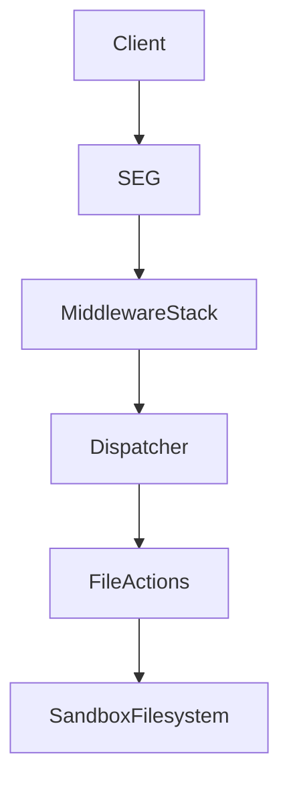
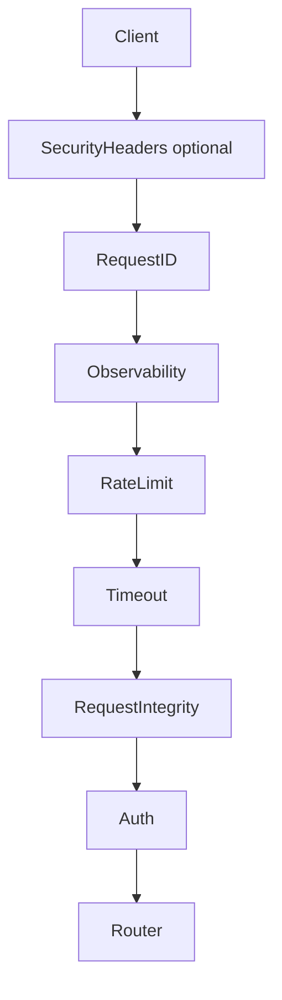
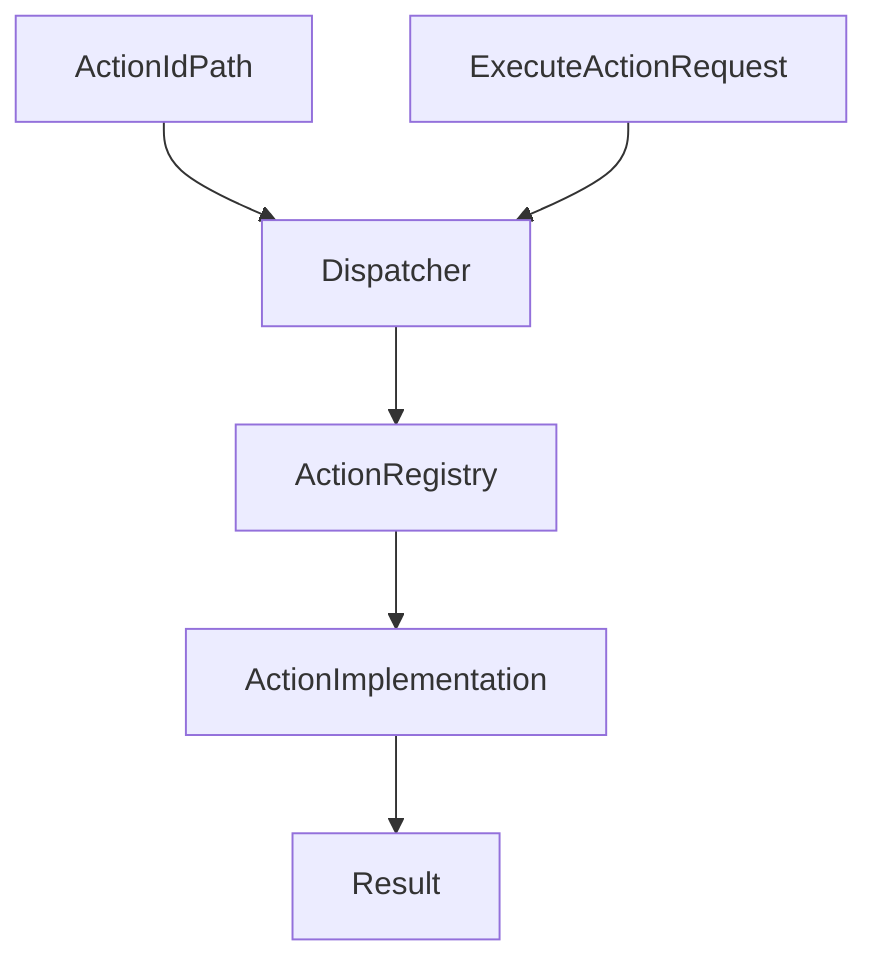
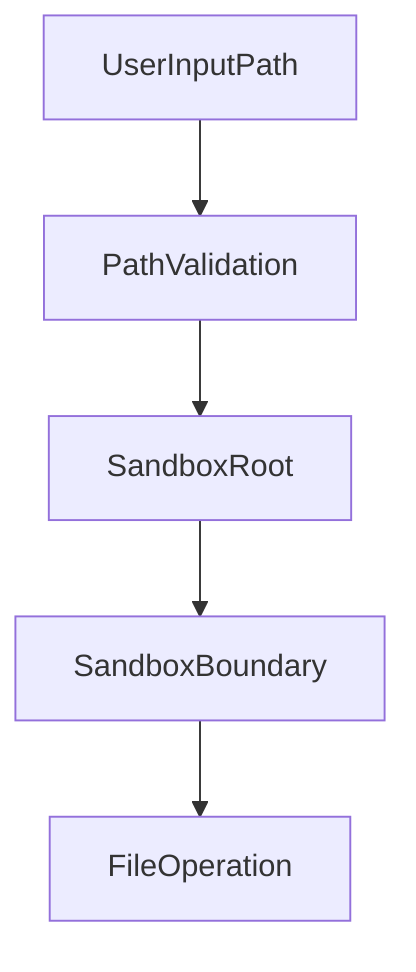
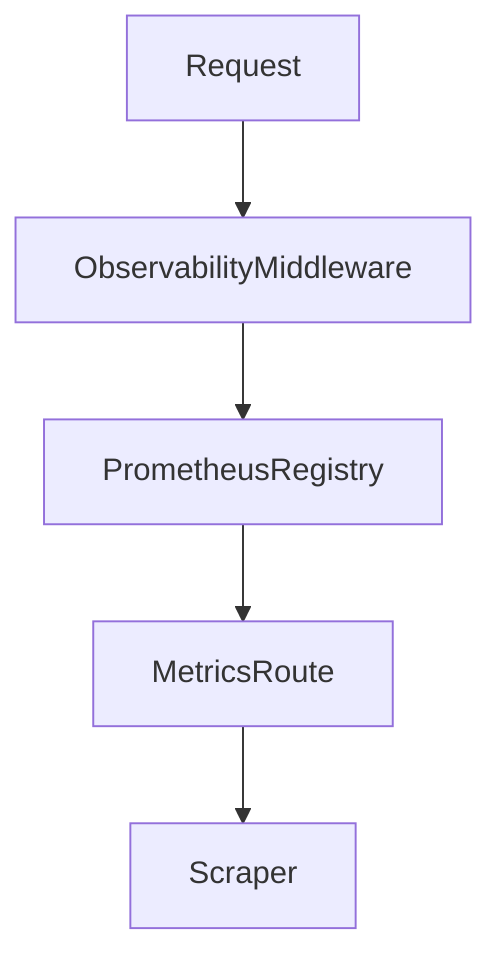

# SEG Architecture

## Table of Contents

- [1. System Overview](#1-system-overview)
- [2. Repository Structure](#2-repository-structure)
- [3. FastAPI Application Layer](#3-fastapi-application-layer)
- [4. Middleware Security Layer](#4-middleware-security-layer)
- [5. Action Execution Model](#5-action-execution-model)
- [6. Filesystem Security Model](#6-filesystem-security-model)
- [7. Configuration System](#7-configuration-system)
- [8. Observability and Metrics](#8-observability-and-metrics)
- [9. API Documentation System](#9-api-documentation-system)
- [10. Container Runtime Model](#10-container-runtime-model)
- [11. Testing Architecture](#11-testing-architecture)

## 1. System Overview

Secure Execution Gateway (SEG) is a FastAPI-based internal microservice that exposes a small allowlisted action execution surface together with SEG-managed file CRUD endpoints. It is designed to run inside trusted container infrastructure and to operate only inside a configured sandbox directory.

The service is not a generic command runner. Requests enter through HTTP, pass through a defense-in-depth middleware stack, and then reach a dispatcher that resolves a registered action implementation. File actions apply centralized path and filesystem controls before touching the sandboxed filesystem.

## 2. Repository Structure

The main implementation lives under `src/seg`.

| Path | Role |
| --- | --- |
| `src/seg` | Application package containing the app factory, core helpers, routes, middleware, and action system. |
| `src/seg/actions` | Dispatcher, registry, action discovery, domain exceptions, and concrete action modules. |
| `src/seg/middleware` | HTTP middleware for authentication, request hygiene, observability, rate limiting, timeout control, request IDs, and response security headers. |
| `src/seg/core` | Shared configuration, error definitions, OpenAPI generation, response schemas, and security utilities. |
| `src/seg/routes` | Thin FastAPI route handlers for `/v1/actions`, `/v1/files`, `/health`, and `/metrics`. |
| `tests` | Smoke, unit, and integration tests covering application startup, schemas, security helpers, middleware, routes, dispatcher behavior, and file actions. |

Within `src/seg/actions/file`, each supported file capability is implemented in its own module: `checksum.py`, `delete.py`, `mime_detect.py`, `move.py`, and `verify.py`. Shared action request and response models live in `src/seg/actions/file/schemas.py`.

## 3. FastAPI Application Layer

The application is built in `src/seg/app.py` by `create_app()`. The factory loads `Settings`, configures documentation URLs, stores settings on `app.state`, discovers action modules, registers middleware, installs global exception handlers, and includes the route modules.

### Application initialization

Key application behaviors in `app.py`:

- `SEGApp` subclasses `FastAPI` and overrides `openapi()` to build and cache a custom OpenAPI document through `build_openapi_schema()`.
- `create_app()` accepts an optional prebuilt `Settings` instance, which keeps tests isolated from process environment state.
- Interactive documentation endpoints are enabled only when `seg_enable_docs` is true. In that case `/docs`, `/redoc`, and `/openapi.json` are registered; otherwise they are disabled.
- Action modules are discovered at startup by `discover_and_register()`, which imports submodules under `seg.actions` so they can register themselves.

### Router registration

The app includes four route modules:

- `/v1/actions`: authenticated action discovery endpoint.
- `/v1/actions/{action_id}`: authenticated action contract retrieval and execution endpoints.
- `/v1/files`: SEG-managed file CRUD and content streaming endpoints.
- `/health`: readiness endpoint that returns `{"status": "ok"}` inside the standard response envelope.
- `/metrics`: Prometheus exposition endpoint.

### Exception handling

Two global handlers are registered:

- `http_exception_handler` maps Starlette HTTP exceptions to SEG error codes and preserves `X-Request-Id` when present.
- `generic_exception_handler` logs unhandled exceptions and returns a generic 500 response envelope.

### Endpoint model

The `/v1/actions` routes are intentionally thin. `GET /v1/actions` reads the in-memory registry and returns grouped action summaries. `GET /v1/actions/{action_id}` returns the public contract for one registered action. `POST /v1/actions/{action_id}` validates the body against `ExecuteActionRequest`, delegates execution to `execute_action_handler()`, and returns the typed execution result as a JSON response envelope. `/v1/files` exposes typed handlers for upload, metadata retrieval, listing, content download, and deletion using `file_id` identifiers. Health and metrics are separated into dedicated routes and do not contain business logic.

## 4. Middleware Security Layer

SEG applies several middleware layers in `src/seg/middleware`. In `app.py`, middleware is added in reverse of the runtime execution order because Starlette runs the last added middleware first.

Actual runtime order:

1. `SecurityHeadersMiddleware` when `seg_enable_security_headers` is enabled
2. `RequestIDMiddleware`
3. `ObservabilityMiddleware`
4. `RateLimitMiddleware`
5. `TimeoutMiddleware`
6. `RequestIntegrityMiddleware`
7. `AuthMiddleware`
8. Router handler

If security headers are disabled, the pipeline starts at `RequestIDMiddleware`.

### `AuthMiddleware`

- Requires `Authorization: Bearer <token>` for protected endpoints.
- Uses `hmac.compare_digest()` for token comparison.
- Exempts `/health` and `/metrics`.
- Also exempts `/docs`, `/redoc`, and `/openapi.json` when runtime docs are enabled.
- Returns a 401 response envelope with `WWW-Authenticate: Bearer` on failure.

### `RequestIntegrityMiddleware`

- Operates at ASGI level.
- Rejects malformed request paths containing NUL bytes, backslashes, or disallowed control characters.
- Rejects malformed raw headers, including duplicate `Authorization` headers, whitespace in header names, and control characters in names or values.
- Rejects requests that contain both `Content-Length` and `Transfer-Encoding`.
- Enforces `application/json` for `POST /v1/actions/{action_id}` and `multipart/form-data` for `POST /v1/files`.
- Enforces maximum body size through strict `Content-Length` parsing or streaming body counting when the header is absent.
- Emits rejection metrics through `seg_request_integrity_rejections_total`.

### `RateLimitMiddleware`

- Uses an in-memory async-safe token bucket.
- Enforces a global requests-per-second limit from `seg_rate_limit_rps`.
- Exempts `/metrics` and, when docs are enabled, the docs endpoints.
- Returns a structured 429 response with `Retry-After` when the bucket is empty.
- Emits `seg_rate_limited_total`.

### `TimeoutMiddleware`

- Wraps downstream execution with `asyncio.wait_for()`.
- Uses `seg_timeout_ms`, clamped to a minimum of 100 ms.
- Exempts `/health` and `/metrics`.
- Converts timeouts and cancellations to a standardized 504 response.
- Emits `seg_timeouts_total`.

### `RequestIDMiddleware`

- Accepts a client-supplied `X-Request-Id` when it is a valid UUID.
- Otherwise generates a new UUID4.
- Stores the value on `request.state.request_id` for downstream consumers.
- Adds `X-Request-Id` to every response.

### `ObservabilityMiddleware`

- Records request telemetry without changing request or response behavior.
- Excludes `/metrics` from instrumentation by default.
- Tracks total requests, duration, inflight requests, and error-class totals.
- Wraps the ASGI `send` callable to capture the final HTTP status code.

### `SecurityHeadersMiddleware`

- Removes `Server` and `X-Powered-By` response headers.
- Sets baseline headers: `X-Content-Type-Options`, `X-Frame-Options`, `Referrer-Policy`, and `Permissions-Policy`.
- Runs only when `seg_enable_security_headers` is true.

## 5. Action Execution Model

The action system lives in `src/seg/actions` and separates action discovery, registration, dispatch, and implementation.

### Registration model

- `discover_and_register()` recursively imports modules under `seg.actions`.
- Each action module registers itself at import time by calling `register_action(ActionSpec(...))`.
- `ActionSpec` defines the action name, input model, async handler, optional result model, and OpenAPI metadata.
- The registry is an explicit allowlist stored in memory. Duplicate registrations are rejected.

### Dispatch model

`dispatch_action()` performs the runtime action flow:

1. Look up the action by `action_id` in the registry.
2. Validate `req.params` with the action-specific Pydantic `params_model`.
3. Execute the async handler.
4. Validate the returned payload with `result_model` when one is defined.
5. Normalize expected and unexpected failures into a `ResponseEnvelope` plus HTTP status.

Known domain failures are transported through `SegError` (defined in `src/seg/core/errors.py`), which carries a stable SEG error code, HTTP status, message, and optional details.

### File action modules

Current action implementations are:

- `file_checksum`: secure checksum computation with size enforcement and timeout wrapping.
- `file_delete`: safe deletion of regular files, including idempotent behavior when `require_exists` is false.
- `file_mime_detect`: content-based MIME detection using `python-magic`.
- `file_move`: sandboxed move using `os.replace()` with overwrite policy and extension preservation.
- `file_verify`: composite verification that reuses `file_mime_detect()` and `file_checksum()`.

`file_verify` is the only composite action. It validates the path once, detects MIME type, applies optional extension and MIME policies, and optionally compares a checksum.

## 6. Filesystem Security Model

Filesystem security is implemented primarily in `src/seg/core/security/paths.py` and `src/seg/core/security/file_access.py`.

### Path validation and sandbox enforcement

`sanitize_rel_path()` rejects:

- NUL bytes
- backslashes
- control characters
- empty paths
- absolute paths
- `..` traversal segments
- excessively long paths

`resolve_in_sandbox()` then:

- resolves the configured sandbox root strictly
- rejects symlinks in any existing path component
- normalizes the candidate path with `os.path.normpath()`
- verifies the final candidate stays inside the sandbox with `os.path.commonpath()`

### Safe file opening

`safe_open_no_follow()` opens the final path component with `O_NOFOLLOW` when the platform supports it, then uses `os.fstat()` to ensure the target is a regular file. This reduces symlink attacks on the final component.

`validate_path()` combines sandbox resolution, existence checks, optional regular-file checks, and optional secure open behavior. `file_access.py` builds on it with wrappers for secure read-only access, validation-only checks, and destination validation for move operations.

### Destination handling

`secure_file_destination_validate()` distinguishes between:

- a valid non-existent destination
- an existing regular file destination (`DestinationExistsError`)
- an existing non-regular destination (`DestinationNotRegularError`)

This lets `file_move` enforce overwrite policy without bypassing sandbox checks.

### MIME mapping support

`src/seg/core/security/mime_map.py` contains a fixed extension-to-MIME allowlist used by `file_verify` when the caller does not supply `expected_mime`. MIME validation itself is performed by the action layer, not by middleware.

## 7. Configuration System

Configuration is defined in `src/seg/core/config.py` with a Pydantic `BaseSettings` model.

> [!IMPORTANT]
> `SEG_ROOT_DIR` must be configured before SEG can start. If this value is
> missing or invalid, configuration loading aborts the process.

### Loading behavior

- Settings are loaded lazily through `get_settings()` and cached with `lru_cache`.
- `.env` is used as an environment file source.
- Environment variable matching is case-insensitive.
- Unrelated environment variables are ignored.

### Required and validated settings

Required settings include:

- `SEG_ROOT_DIR`

Validated runtime controls include:

- `SEG_MAX_FILE_BYTES`
- `SEG_TIMEOUT_MS`
- `SEG_RATE_LIMIT_RPS`
- `SEG_APP_VERSION`
- `SEG_ENABLE_DOCS`
- `SEG_ENABLE_SECURITY_HEADERS`

### API token loading

The API token is not read directly from the settings model. `get_settings()` calls `load_seg_api_token()`, which loads the token from `/run/secrets/seg_api_token`. If that secret file is missing, the code falls back to `SEG_API_TOKEN_DEV` for development use.

`validate_api_token()` trims the token and enforces:

- minimum length of 32 characters
- at least two character classes among lowercase, uppercase, digits, and symbols

### `.env.example`

`.env.example` documents the expected runtime configuration for:

- non-root container identity
- Docker and Compose integration
- strict sandbox root location
- body size, timeout, and rate-limit controls
- logging and application version
- docs toggle and security-header toggle

## 8. Observability and Metrics

Observability is implemented in `src/seg/middleware/observability.py` and exposed by `src/seg/routes/metrics.py`.

### Prometheus exposure

`/metrics` returns the output of `prometheus_client.generate_latest()` with Prometheus's content type. The route is intentionally small and does not build metrics itself.

### Request instrumentation

The observability middleware exports:

- `seg_http_requests_total` labeled by method, normalized path, and status code
- `seg_http_request_duration_seconds` labeled by method, normalized path, and status class
- `seg_http_inflight_requests`
- `seg_http_errors_total` labeled by status class

Additional middleware-specific metrics are also part of the exported registry:

- `seg_request_integrity_rejections_total`
- `seg_rate_limited_total`
- `seg_timeouts_total`

Paths are normalized before labeling so the metrics layer can aggregate traffic consistently and reduce cardinality.

## 9. API Documentation System

SEG generates OpenAPI dynamically from the live application, action registry, and file route contracts.

### Runtime schema generation

`src/seg/core/openapi.py` starts with FastAPI's `get_openapi()` output and then patches it to match SEG runtime behavior. The builder:

- adds tags and external documentation
- injects a global bearer authentication scheme
- marks `/health` and `/metrics` as public in the OpenAPI document
- registers shared schemas such as `ResponseEnvelope` and `ErrorInfo`
- enriches `POST /v1/actions/{action_id}` with action-specific examples and runtime response variants
- documents the public contracts for `GET /v1/actions` and `GET /v1/actions/{action_id}`
- applies explicit `/v1/files` contract overrides for upload, metadata retrieval, listing, content streaming, and delete operations
- adds SEG response headers such as `X-Request-Id` and `Retry-After`
- removes internal-only schemas from the published document
- overrides the generated contracts for `/health` and `/metrics`

The docs endpoints `/docs`, `/redoc`, and `/openapi.json` are controlled by `seg_enable_docs` in `app.py`.

### Export pipeline

`scripts/export_openapi.py` creates a documentation-only `Settings` object, enables docs, builds the app, generates the schema, and writes `docs/api-docs/output/openapi.json`.

`scripts/build_docs_site.py` takes that exported schema, copies a Swagger UI distribution into a versioned site directory, installs the project template as `index.html`, and creates redirects for the latest published version.

### CI publication

The repository contains a dedicated GitHub Actions workflow in `.github/workflows/release-docs.yml` that runs on version tags. It exports the OpenAPI schema, validates it, builds the versioned documentation site, and publishes it to the `gh-pages` branch.

## 10. Container Runtime Model

The container runtime is defined by `Dockerfile` and `docker-compose.yml`.

### Docker image

The image:

- uses `python:3.12-slim`
- installs `ca-certificates`, `curl`, and `libmagic1`
- creates a deterministic non-root user and group from build args
- installs runtime Python dependencies from `requirements/runtime.txt`
- copies the application source into `/app`
- starts Uvicorn with `uvicorn --factory seg.app:create_app`
- exposes `SEG_PORT`
- runs a healthcheck against `http://localhost:${SEG_PORT}/health`

### Compose service model

The Compose service:

- runs the ephemeral `seg-init` helper service before `seg` starts
- builds the image from the repository Dockerfile
- loads environment variables from `.env`
- mounts the persistent volume at `${SEG_ROOT_DIR}`
- injects the API token through the `seg_api_token` Docker secret backed by `./secrets/seg_api_token.txt`
- attaches the service to an external Docker network named by `SHARED_DOCKER_NETWORK`
- does not publish a host port in the provided Compose file
- restarts with `unless-stopped`

`seg-init` applies ownership and permission bootstrap (`NON_ROOT_UID:NON_ROOT_GID` with writable group permissions) on the mounted root before runtime startup.

This matches the internal-service deployment model: SEG is intended to be reachable from other trusted containers on the shared network, not from a public edge.

## 11. Testing Architecture

Testing is organized by scope:

- `tests/test_app_smoke.py` covers basic application startup and health behavior.
- `tests/actions` covers the dispatcher, registry, and file action modules.
- `tests/core` covers schemas, settings, and security helpers.
- `tests/integration/middleware` exercises middleware behavior end to end.
- `tests/integration/routes` exercises route-level behavior for `/v1/actions`, `/v1/actions/{action_id}`, `/v1/files`, `/health`, and `/metrics`.

The test layout separates unit-level validation of the action and security primitives from integration-level checks of the HTTP surface.
