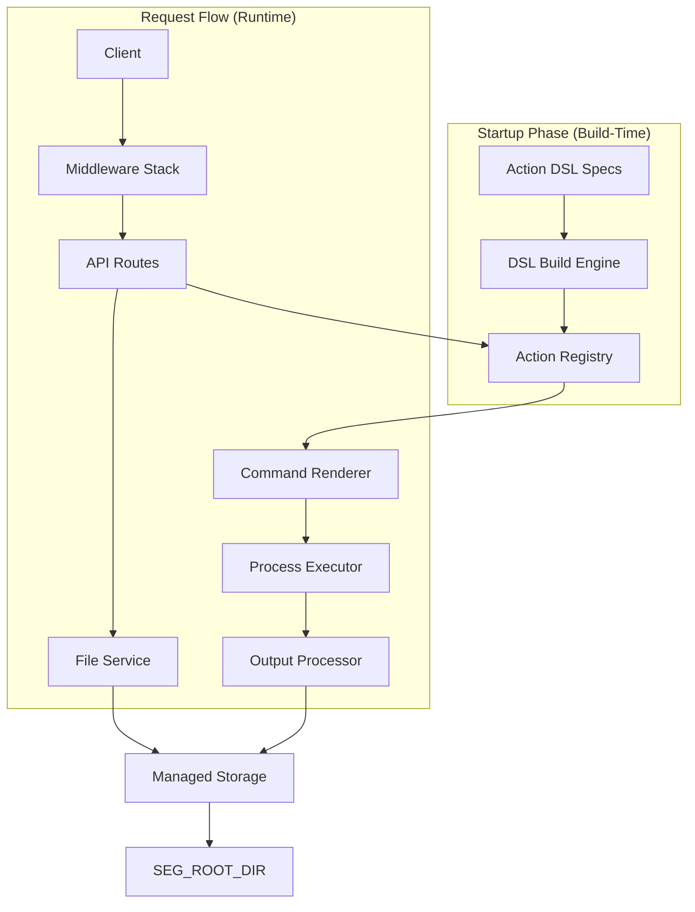
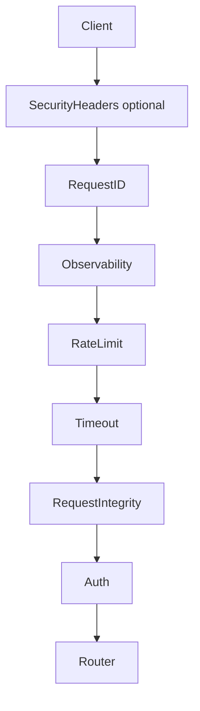
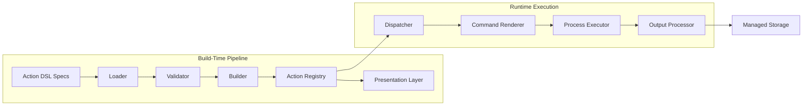
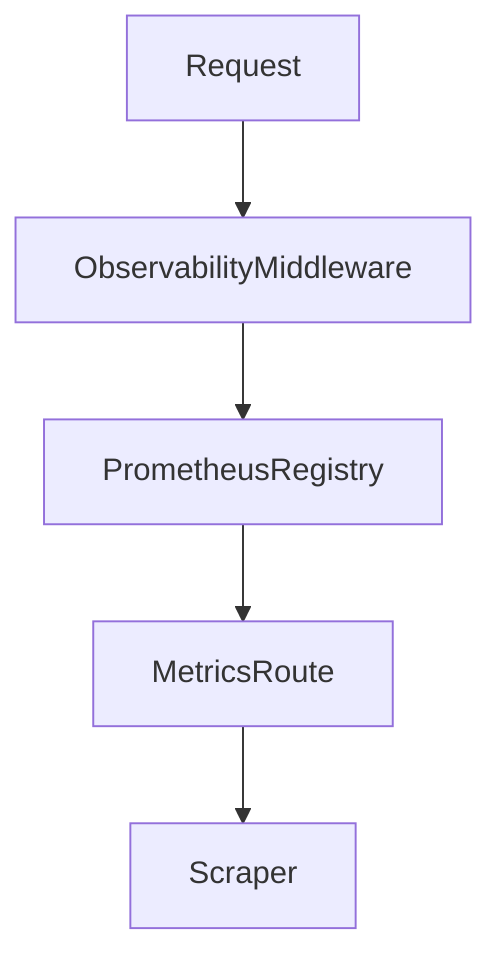

# SEG Architecture

## Table of Contents

- [1. System Overview](#1-system-overview)
- [2. Repository Structure](#2-repository-structure)
- [3. FastAPI Application Layer](#3-fastapi-application-layer)
- [4. Middleware Security Layer](#4-middleware-security-layer)
- [5. Action Execution Model](#5-action-execution-model)
- [6. Managed File and Filesystem Security Model](#6-managed-file-and-filesystem-security-model)
- [7. Configuration System](#7-configuration-system)
- [8. Observability and Metrics](#8-observability-and-metrics)
- [9. API Documentation System](#9-api-documentation-system)
- [10. Container Runtime Model](#10-container-runtime-model)
- [11. Testing Architecture](#11-testing-architecture)

## 1. System Overview

Secure Execution Gateway (SEG) is a FastAPI-based internal microservice that exposes a small authenticated execution surface together with a SEG-managed file service accessible through `/v1/files`.

The service is not a generic shell gateway. At startup, SEG discovers YAML-based Action DSL specifications, validates them, compiles them into immutable runtime `ActionSpec` objects, and stores them in an in-memory registry. At request time, clients can only execute those predeclared actions through `/v1/actions/{action_id}`.

An action is therefore best understood as predefined command execution, but with SEG controls around it:

- only DSL-declared binaries, args, flags, and outputs are accepted
- request params are validated against generated Pydantic models
- command rendering is deterministic and template-constrained
- binary policy checks are enforced both at build time and at execution time
- stdout and stderr are sanitized before they are returned, and file outputs may be materialized either from declared command placeholders or from sanitized stdout when `stdout_as_file` is requested and allowed

SEG also exposes `/v1/files`, which provides the supported external lifecycle for uploaded and generated files. Storage is rooted under `SEG_ROOT_DIR`, and callers interact with UUID-based file identifiers rather than raw filesystem paths.

## 2. Repository Structure

The main implementation lives under `src/seg`.

| Path | Role |
| --- | --- |
| `src/seg` | Application package containing the app factory, routes, middleware, shared core helpers, and the DSL-backed action system. |
| `src/seg/actions/build_engine` | DSL spec discovery, YAML safety checks, semantic validation, and runtime action compilation. |
| `src/seg/actions/runtime` | Runtime command rendering, subprocess execution, stdout/stderr sanitization, output handling, and file placeholder management. |
| `src/seg/actions/presentation` | Public action catalog, request/response contract generation, and OpenAPI-facing serializers. |
| `src/seg/actions/specs` | Built-in YAML action modules that define the shipped action catalog. |
| `src/seg/middleware` | Authentication, request integrity, request ID, observability, rate limiting, timeout, and optional security headers. |
| `src/seg/core` | Settings, errors, OpenAPI generation, storage utilities, security helpers, and shared response schemas. |
| `src/seg/routes` | Thin HTTP handlers for `/v1/actions`, `/v1/files`, `/health`, and `/metrics`. |
| `tests` | Smoke, unit, and integration tests covering startup, settings, middleware, action build/runtime layers, file APIs, and OpenAPI behavior. |
| `scripts` | Helper scripts for OpenAPI export, docs site generation, and local port forwarding. |

## 3. FastAPI Application Layer

The application is built in `src/seg/app.py` by `create_app()`.

### Application initialization

Key startup behaviors are:

- load `Settings` through `get_settings()` unless a test provides one explicitly
- create storage directories through `ensure_storage_dirs(settings)`
- register `/docs`, `/redoc`, and `/openapi.json` by default unless `seg_enable_docs` is set to false
- build the immutable runtime action registry through `build_registry_from_specs(settings)`
- attach both `settings` and `action_registry` to `app.state`
- register middleware, exception handlers, and routers

`SEGApp` subclasses `FastAPI` and overrides `openapi()` so the application can lazily build and cache a runtime-aware schema through `build_openapi_schema()`.

### Router registration

The app includes four route modules:

- `/v1/actions`: authenticated discovery, contract retrieval, and execution for DSL-defined actions
- `/v1/files`: SEG-managed upload, metadata retrieval, listing, content streaming, and deletion
- `/health`: readiness endpoint that returns `{"status": "ok"}` in the standard response envelope
- `/metrics`: Prometheus exposition endpoint

### Exception handling

Two global handlers are installed:

- `http_exception_handler` maps Starlette HTTP exceptions into SEG envelopes while preserving `X-Request-Id`
- `generic_exception_handler` logs unhandled exceptions and returns a generic structured 500 response

The route layer is intentionally thin. It resolves application state, delegates to runtime or storage handlers, and maps domain exceptions to stable SEG error codes.

## 4. Middleware Security Layer

SEG applies several middleware layers in `src/seg/middleware`. In `app.py`, middleware is added in reverse of the runtime execution order because Starlette runs the last added middleware first.

Actual runtime order:

1. `SecurityHeadersMiddleware` when `seg_enable_security_headers` is enabled
2. `RequestIDMiddleware`
3. `ObservabilityMiddleware`
4. `RateLimitMiddleware`
5. `TimeoutMiddleware`
6. `RequestIntegrityMiddleware`
7. `AuthMiddleware`
8. Router handler

If security headers are disabled, the pipeline starts at `RequestIDMiddleware`.

### `AuthMiddleware`

- Requires `Authorization: Bearer <token>` for protected endpoints.
- Uses `hmac.compare_digest()` for token comparison.
- Exempts `/health` and `/metrics`.
- Also exempts `/docs`, `/redoc`, and `/openapi.json` when runtime docs are enabled.
- Returns a 401 response envelope with `WWW-Authenticate: Bearer` on failure.

### `RequestIntegrityMiddleware`

- Operates at ASGI level.
- Rejects malformed request paths containing NUL bytes, backslashes, or disallowed control characters.
- Rejects malformed raw headers, including duplicate `Authorization` headers, whitespace in header names, and control characters in names or values.
- Rejects requests that contain both `Content-Length` and `Transfer-Encoding`.
- Enforces `application/json` for `POST /v1/actions/{action_id}` and `multipart/form-data` for `POST /v1/files`.
- Enforces maximum body size through strict `Content-Length` parsing or streaming body counting when the header is absent.
- Emits rejection metrics through `seg_request_integrity_rejections_total`.

### `RateLimitMiddleware`

- Uses an in-memory async-safe token bucket.
- Enforces a global requests-per-second limit from `seg_rate_limit_rps`.
- Exempts `/metrics` and, when docs are enabled, the docs endpoints.
- Returns a structured 429 response with `Retry-After` when the bucket is empty.
- Emits `seg_rate_limited_total`.

### `TimeoutMiddleware`

- Wraps downstream execution with `asyncio.wait_for()`.
- Uses `seg_timeout_ms`, clamped to a minimum of 100 ms.
- Exempts `/health` and `/metrics`.
- Converts timeouts and cancellations to a standardized 504 response.
- Emits `seg_timeouts_total`.

### `RequestIDMiddleware`

- Accepts a client-supplied `X-Request-Id` when it is a valid UUID.
- Otherwise generates a new UUID4.
- Stores the value on `request.state.request_id` for downstream consumers.
- Adds `X-Request-Id` to every response.

### `ObservabilityMiddleware`

- Records request telemetry without changing request or response behavior.
- Excludes `/metrics` from instrumentation by default.
- Tracks total requests, duration, inflight requests, and error-class totals.
- Wraps the ASGI `send` callable to capture the final HTTP status code.

### `SecurityHeadersMiddleware`

- Removes `Server` and `X-Powered-By` response headers.
- Sets baseline headers: `X-Content-Type-Options`, `X-Frame-Options`, `Referrer-Policy`, and `Permissions-Policy`.
- Runs only when `seg_enable_security_headers` is true.

## 5. Action Execution Model

The action system lives in `src/seg/actions` and is split into build-time, presentation, and runtime layers.

### Build-time pipeline

At startup, `build_registry_from_specs()` performs the following steps:

1. `load_module_specs()` discovers YAML-based Action DSL specifications from the configured spec directories.
2. Loader safety checks reject invalid file sizes, invalid extensions, NUL bytes, disallowed control characters, and dangerous YAML patterns.
3. `validate_modules()` enforces semantic DSL rules such as module uniqueness, supported DSL version, binary declarations, identifier format, and action structure.
4. `build_actions()` compiles validated modules into immutable runtime `ActionSpec` objects with generated `params_model` classes, command templates, defaults, output declarations, stdout file policy, and binary execution policy.
5. `ActionRegistry` stores the final action mapping and precomputes presentation summaries.

This is the allowlist boundary. If a spec is invalid, the registry is not built and the application fails to start.

### Runtime execution path

`POST /v1/actions/{action_id}` eventually reaches `dispatch_action()`, which performs the runtime flow:

1. Resolve the action from `ActionRegistry`.
2. Validate request params and execution options, including `stdout_as_file` policy checks.
3. Render the final argv list with `render_command()`.
4. Resolve `file_id` args and output placeholders through the managed file layer.
5. Re-check binary policy and execute the argv with `asyncio.create_subprocess_exec()` in `execute_command()`.
6. Process stdout and stderr through the output pipeline, including sanitization, declared command-output handling, and optional `stdout_file` materialization from sanitized stdout.

### What an action means in SEG

An action is not arbitrary shell submitted by the client.

An action is a predeclared command template whose binary, accepted params, flag mapping, output declarations, and public contract are all defined in YAML and compiled before the service accepts traffic. Clients only provide values for the declared parameter surface.

In SEG, an action is safer than direct command execution because the command shape is frozen by the DSL and enforced by validation, rendering, policy checks, and response sanitization.

## 6. Managed File and Filesystem Security Model

SEG supports two related file surfaces:

- the external managed file API under `/v1/files`
- internal filesystem security helpers used by runtime storage and security-sensitive operations

### Managed file API

`src/seg/routes/files/router.py` exposes the supported external file lifecycle:

- `POST /v1/files` uploads a file, validates it, and persists blob plus metadata
- `GET /v1/files` lists files with cursor pagination and filtering
- `GET /v1/files/{id}` returns metadata only
- `GET /v1/files/{id}/content` streams persisted blob content
- `DELETE /v1/files/{id}` deletes a managed file

The file API is UUID-based. Clients do not provide raw filesystem paths to retrieve stored content. Uploaded files are persisted as immutable blobs with metadata sidecars under storage rooted at `SEG_ROOT_DIR`.

Action outputs can also be materialized into SEG-managed storage. Declared `file + command` outputs use runtime placeholders created before subprocess execution and finalized into managed file records after successful output handling. Sanitized stdout can also be materialized into the reserved `outputs.stdout_file` entry when the client requests `stdout_as_file=true` and the selected action allows it.

### Filesystem security primitives

Lower-level path protections exist in `src/seg/core/security/paths.py` and related helpers.

`sanitize_rel_path()` rejects:

- NUL bytes
- backslashes
- control characters
- empty paths
- absolute paths
- `..` traversal segments
- excessively long paths

`resolve_in_sandbox()` then:

- resolves the configured sandbox root strictly
- rejects symlinks in any existing path component
- normalizes the candidate path with `os.path.normpath()`
- verifies the final candidate stays inside the sandbox with `os.path.commonpath()`

`safe_open_no_follow()` opens the final component with `O_NOFOLLOW` when the platform supports it and verifies that the target is a regular file.

These helpers remain relevant because SEG still treats `SEG_ROOT_DIR` as a hardened storage boundary, even though the public API prefers managed `file_id` references over direct path exposure.

## 7. Configuration System

Configuration is defined in `src/seg/core/config.py` with a Pydantic `BaseSettings` model.

> [!IMPORTANT]
> `SEG_ROOT_DIR` must be configured before SEG can start. If this value is missing or invalid, configuration loading aborts the process. Its default and recommended value is `/var/lib/seg`

### Loading behavior

- Settings are loaded lazily through `get_settings()` and cached with `lru_cache`.
- `.env` is used as an environment file source.
- Environment variable matching is case-insensitive.
- Unrelated environment variables are ignored.

### Required and validated settings

Required settings include:

- `SEG_ROOT_DIR`

Validated runtime controls include:

- `SEG_MAX_FILE_BYTES`
- `SEG_MAX_YML_BYTES`
- `SEG_TIMEOUT_MS`
- `SEG_RATE_LIMIT_RPS`
- `SEG_APP_VERSION`
- `SEG_ENABLE_DOCS`
- `SEG_ENABLE_SECURITY_HEADERS`
- `SEG_BLOCKED_BINARIES_EXTRA`

### API token loading

The API token is not read directly from the settings model. `get_settings()` calls `load_seg_api_token()`, which loads the token from `/run/secrets/seg_api_token`. If that secret file is missing, the code falls back to `SEG_API_TOKEN_DEV` for development use.

`validate_api_token()` trims the token and enforces:

- minimum length of 32 characters
- at least two character classes among lowercase, uppercase, digits, and symbols

### `.env.example`

`.env.example` documents the expected runtime configuration for:

- non-root container identity
- Docker and Compose integration
- strict sandboxed storage root location
- body size, timeout, and rate-limit controls
- logging and application version
- docs toggle and security-header toggle

## 8. Observability and Metrics

Observability is implemented in `src/seg/middleware/observability.py` and exposed by `src/seg/routes/metrics.py`.

### Prometheus exposure

`/metrics` returns the output of `prometheus_client.generate_latest()` with Prometheus's content type. The route is intentionally small and does not build metrics itself.

### Request instrumentation

The observability middleware exports:

- `seg_http_requests_total` labeled by method, normalized path, and status code
- `seg_http_request_duration_seconds` labeled by method, normalized path, and status class
- `seg_http_inflight_requests`
- `seg_http_errors_total` labeled by status class

Additional middleware-specific metrics are also part of the exported registry:

- `seg_request_integrity_rejections_total`
- `seg_rate_limited_total`
- `seg_timeouts_total`

Paths are normalized before labeling so the metrics layer can aggregate traffic consistently and reduce cardinality.

## 9. API Documentation System

SEG generates OpenAPI dynamically from the live application, the runtime action registry, and the file route contracts.

### Runtime schema generation

`src/seg/core/openapi.py` starts with FastAPI's `get_openapi()` output and then patches it to match SEG runtime behavior. The builder:

- adds tags and external documentation
- injects a global bearer authentication scheme
- marks `/health` and `/metrics` as public in the OpenAPI document
- registers shared schemas such as `ResponseEnvelope` and `ErrorInfo`
- enriches `POST /v1/actions/{action_id}` with action-specific examples and runtime response variants
- documents the public contracts for `GET /v1/actions` and `GET /v1/actions/{action_id}`
- applies explicit `/v1/files` contract overrides for upload, metadata retrieval, listing, content streaming, and delete operations
- adds SEG response headers such as `X-Request-Id` and `Retry-After`
- removes internal-only schemas from the published document
- overrides the generated contracts for `/health` and `/metrics`

The docs endpoints `/docs`, `/redoc`, and `/openapi.json` are enabled by default and controlled by `seg_enable_docs` in `app.py`.

### Export pipeline

`scripts/export_openapi.py` creates a documentation-specific `Settings` object, enables docs, builds the app, generates the schema, and writes `docs/api-docs/output/openapi.json`.

`scripts/build_docs_site.py` takes that exported schema, copies a Swagger UI distribution into a versioned site directory, installs the project template as `index.html`, and creates redirects for the latest published version.

### CI publication

The repository contains a dedicated GitHub Actions workflow in `.github/workflows/release-docs.yml` that runs on version tags. It exports the OpenAPI schema, validates it, builds the versioned documentation site, and publishes it to the `gh-pages` branch.

## 10. Container Runtime Model

The container runtime is defined by `Dockerfile` and `docker-compose.yml`.

### Docker image

The image:

- uses `python:3.12-slim`
- installs `ca-certificates`, `curl`, and `libmagic1`
- creates a deterministic non-root user and group from build args
- installs runtime Python dependencies from `requirements/runtime.txt`
- copies the application source into `/app`
- removes group and other write permissions from `/app`
- starts Uvicorn with `uvicorn --factory seg.app:create_app`
- exposes `SEG_PORT`
- runs a healthcheck against `http://localhost:${SEG_PORT}/health`

### Compose service model

The Compose service:

- runs the ephemeral `seg-init` helper service before `seg` starts
- builds the image from the repository Dockerfile
- loads environment variables from `.env`
- mounts the persistent volume at `${SEG_ROOT_DIR}`
- injects the API token through the `seg_api_token` Docker secret backed by `./secrets/seg_api_token.txt`
- attaches the service to an external Docker network named by `SHARED_DOCKER_NETWORK`
- does not publish a host port in the provided Compose file
- restarts with `unless-stopped`

`seg-init` creates the root directory, assigns ownership to the non-root runtime user, and normalizes directory and file permissions on the mounted storage volume before the API service starts.

This matches the intended internal-service deployment model: SEG is meant to be reachable from other trusted containers on the shared network, not from a public edge.

## 11. Testing Architecture

Testing is organized by scope:

- `tests/test_app_smoke.py` covers basic application startup and health behavior.
- `tests/actions` covers registry construction, DSL loader and validator behavior, runtime dispatch, presentation helpers, and execution-related slices.
- `tests/core` covers schemas, settings, OpenAPI helpers, and security utilities.
- `tests/integration/middleware` exercises middleware behavior end to end.
- `tests/integration/routes` exercises route-level behavior for `/v1/actions`, `/v1/files`, `/health`, `/metrics`, and `/openapi.json`.

The test layout separates unit-level validation of the DSL and security primitives from integration-level checks of the HTTP surface and generated documentation.
