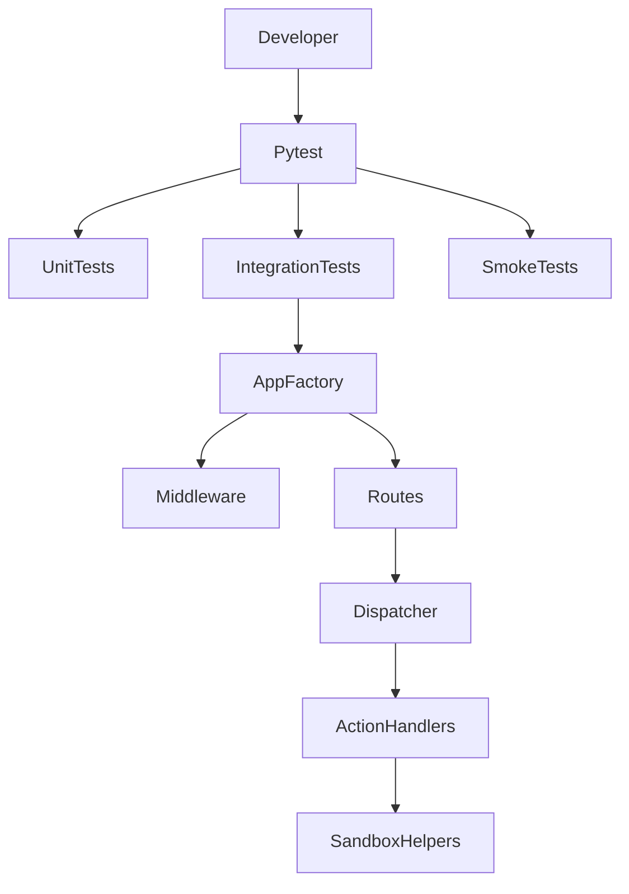

# SEG Testing Strategy

## Table of Contents

- [1. Testing Overview](#1-testing-overview)
- [2. Testing Philosophy](#2-testing-philosophy)
- [3. Test Suite Structure](#3-test-suite-structure)
- [4. Unit Testing](#4-unit-testing)
- [5. Integration Testing](#5-integration-testing)
- [6. Security Testing](#6-security-testing)
- [7. Test Fixtures and Utilities](#7-test-fixtures-and-utilities)
- [8. Running Tests Locally](#8-running-tests-locally)
- [9. CI Test Execution](#9-ci-test-execution)

## 1. Testing Overview

The SEG test suite validates both functional correctness and security-critical behavior.

The current tests cover:

- action dispatcher and registry behavior
- file action implementations
- filesystem sandbox protections
- middleware enforcement
- API endpoints
- request validation and OpenAPI output
- configuration loading and validation

The suite combines unit tests, integration tests, and smoke tests. Unit tests focus on isolated modules and deterministic invariants. Integration tests build a full FastAPI application instance and validate the HTTP contract around middleware, routes, and action dispatch.



## 2. Testing Philosophy

The test suite is designed around deterministic execution and isolation.

> [!IMPORTANT]
> Tests are intentionally isolated from local shell variables and `.env` files.
> This prevents machine-specific configuration from changing test outcomes.

The current design goals are:

- deterministic behavior across runs
- strict isolation from local developer environments
- independence from `.env` files
- no reliance on test execution order
- validation of both success paths and failure paths
- security-focused checks for filesystem and HTTP handling

`tests/conftest.py` enforces this through the autouse fixture `clean_seg_environment`.

`clean_seg_environment`:

- removes all `SEG_*` environment variables from the process environment
- disables `.env` loading by setting `Settings.model_config["env_file"]` to `None`
- clears the cached `get_settings()` result before each test

This is necessary because application settings are loaded lazily and cached. Without this fixture, local shell variables or a developer `.env` file could leak into tests, and tests that mutate environment variables could become order-dependent.

The suite also validates both expected and rejected behavior. Many tests assert stable error codes, response envelopes, headers, and metrics, not only successful outcomes.

## 3. Test Suite Structure

The test suite is organized under `tests/`.

| Path | Purpose |
| ----- | ----- |
| `tests/test_app_smoke.py` | Basic smoke coverage for app creation and the `/health` endpoint. |
| `tests/actions` | Unit tests for dispatcher logic, registry behavior, and file action implementations. |
| `tests/core` | Unit tests for configuration, request and response schemas, and core security helpers. |
| `tests/integration` | End-to-end HTTP validation for middleware and route behavior using a full app instance. |

Within those directories:

- `tests/actions/file` covers `file_checksum`, `file_delete`, `file_mime_detect`, `file_move`, and `file_verify`
- `tests/core/security` covers path security, HTTP validation helpers, and security header behavior
- `tests/integration/middleware` covers auth, observability, rate limiting, request IDs, request integrity, security headers, and timeout behavior
- `tests/integration/routes` covers `/v1/execute`, `/health`, `/metrics`, and runtime OpenAPI generation

## 4. Unit Testing

Unit tests cover isolated behavior in the dispatcher, registry, file actions, schemas, configuration, and path validation helpers.

Current unit coverage includes:

- `tests/actions/test_dispatcher.py` for action lookup, parameter validation, result validation, propagated domain errors, timeout mapping, and unexpected error handling
- `tests/actions/test_registry.py` for explicit registration, duplicate prevention, lookup, sorted listing, and public registry helpers
- `tests/actions/file/*.py` for file action behavior and stable error mapping
- `tests/core/test_schemas_envelope.py` and `tests/core/test_schemas_execute.py` for request and response schema invariants
- `tests/core/test_settings.py` for environment-backed settings, defaults, required variables, token loading, docs toggles, and validation rules
- `tests/core/security/test_security_path.py` and `tests/core/security/test_security_http_validation.py` for sandbox and HTTP helper behavior

The file action tests are security-oriented unit tests, not only happy path checks. They verify behavior such as:

- supported checksum algorithms and invalid algorithm rejection
- idempotent delete behavior and rejection of directories or symlinks
- MIME detection for realistic file types and file size enforcement
- move overwrite policy, extension preservation, and path restrictions
- verify policy reporting, checksum validation, and MIME mapping errors

The fixture `clean_action_registry` isolates tests that mutate the global action registry.

`clean_action_registry`:

- snapshots the current registry
- replaces the active registry with an empty mapping
- restores the original snapshot after the test

This is necessary because the action registry is global module state. Registry isolation prevents action registration side effects from leaking between tests and keeps dispatcher and registry unit tests deterministic.

## 5. Integration Testing

Integration tests live under `tests/integration/` and validate the behavior of the running FastAPI application.

These tests instantiate the application through `create_app()` and exercise the HTTP surface with `TestClient`.

Middleware integration coverage includes:

- authentication enforcement and exempt endpoints in `test_middleware_auth.py`
- request integrity checks for content type, duplicate headers, conflicting `Content-Length` and `Transfer-Encoding`, and body size limits in `test_middleware_request_integrity.py`
- rate limiting behavior, `Retry-After`, exempt endpoints, and metric labels in `test_middleware_rate_limit.py`
- timeout handling, exempt routes, and timeout metrics in `test_middleware_timeout.py`
- request ID generation and propagation in `test_middleware_request_id.py`
- observability counters, duration histograms, error classification, inflight gauges, and path normalization in `test_middleware_observability.py`
- security header injection, overwrite behavior, and feature toggling in `test_middleware_security_headers.py`

Route integration coverage includes:

- `/v1/execute` request validation, success envelope behavior, and unknown action handling
- `/health` success payload validation
- `/metrics` content type and Prometheus text format validation
- `/openapi.json` validation, security projection, action schema registration, and response overrides when docs are enabled

These tests validate the assembled application stack rather than individual helper functions.

## 6. Security Testing

The test suite includes direct coverage for security-critical logic.

In `tests/core/security`, the current tests validate:

- path traversal rejection
- absolute path rejection
- backslash rejection
- control character rejection
- sandbox root enforcement
- allowed subdirectory enforcement
- symlink rejection during path resolution
- safe opening of regular files without following symlinks
- strict `Content-Length` parsing and content type normalization

In `tests/integration/middleware`, the current tests validate:

- authentication enforcement on protected endpoints
- correct behavior for unauthenticated exempt endpoints
- rejection of duplicate `Authorization` headers
- rejection of malformed request bodies and unsupported content types
- rejection of conflicting `Content-Length` and `Transfer-Encoding` headers
- enforcement of body size limits
- rate limiting under low request budgets
- timeout enforcement and timeout exemptions for `/health` and `/metrics`
- request ID propagation on both successful and failing responses
- security header insertion and fingerprinting header removal

The action unit tests also reinforce security behavior by checking sandbox restrictions, symlink rejection, and stable error mapping inside file operations.

## 7. Test Fixtures and Utilities

Shared fixtures in `tests/conftest.py` provide the common test environment.

### Environment and configuration isolation

- `clean_seg_environment` enforces environment isolation for every test
- `minimal_safe_env` sets a deterministic minimal SEG configuration with `SEG_API_TOKEN_DEV`, `SEG_SANDBOX_DIR`, and `SEG_ALLOWED_SUBDIRS`

### Application fixtures

- `settings` builds a valid `Settings` instance directly with `Settings.model_validate(...)`
- `app` creates a FastAPI application through `create_app(settings)`
- `client` returns a `TestClient` bound to that app

### Authentication helpers

- `api_token` provides a deterministic bearer token for tests
- `auth_headers` returns `Authorization: Bearer <token>` headers for protected endpoint requests

### Filesystem helpers

- `sandbox_dir` creates a temporary sandbox root
- `sandbox_file_factory` creates files inside allowed sandbox subdirectories and returns both absolute and sandbox-relative paths
- `file_factory` creates realistic sample files for MIME-sensitive tests, including text, markdown, CSV, PNG, PDF, ZIP, TAR, GZIP, EXE, ELF, shell, Python, and JavaScript files

These fixtures keep tests reproducible, avoid reliance on machine-local configuration, and provide realistic filesystem inputs without external dependencies.

## 8. Running Tests Locally

The local entry point is defined in the `Makefile`.

Typical commands are:

```bash
make test
```

This runs:

```bash
pytest -q tests
```

Developers can also run `pytest` directly. Project level pytest configuration in `pyproject.toml` sets:

- `testpaths = ["tests"]`
- `pythonpath = ["src"]`
- `addopts = "-ra --strict-markers"`

Testing dependencies are declared in `requirements/testing.txt`, and `requirements/dev.txt` includes the testing, linting, runtime, and security requirement sets.

## 9. CI Test Execution

The same test suite is executed automatically in GitHub Actions.

The CI workflow in `.github/workflows/ci.yml` creates a Python 3.12 virtual environment, installs `requirements/dev.txt`, and runs `make ci`. The `make ci` target includes `make test` as part of the quality gate.

For pipeline details, see [docs/CI.md](./CI.md).

---
