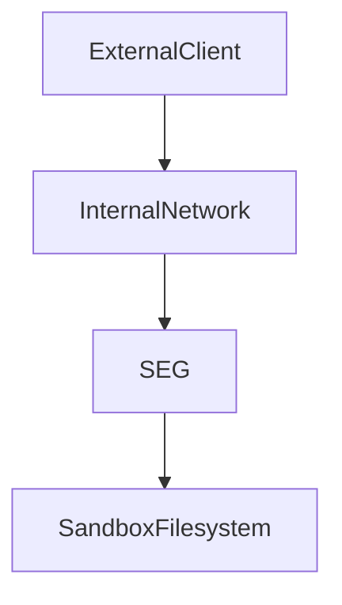
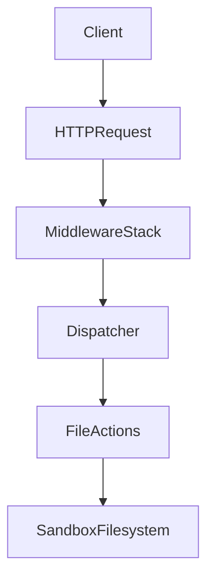

# SEG Threat Model

## Table of Contents

- [1. Security Overview](#1-security-overview)
- [2. Security Goals](#2-security-goals)
- [3. Protected Assets](#3-protected-assets)
- [4. Trust Boundaries](#4-trust-boundaries)
- [5. Attack Surface](#5-attack-surface)
- [6. Threat Categories](#6-threat-categories)
- [7. Security Mitigations](#7-security-mitigations)
- [8. Residual Risks](#8-residual-risks)
- [9. Security Assumptions](#9-security-assumptions)
- [10. Trust Boundary Diagram](#10-trust-boundary-diagram)

## 1. Security Overview

SEG is an internal FastAPI service that exposes a strict allowlist of file operations. It runs inside container infrastructure and performs all file access inside a configured sandbox filesystem root.

The service does not execute arbitrary commands. Clients can only call actions that are registered in the in-memory action registry. Each request passes through multiple validation and control layers before an action handler can touch the filesystem.

SEG uses defense in depth through these mechanisms:

- bearer token authentication enforced by `AuthMiddleware`
- API token loading from the Docker secret `/run/secrets/seg_api_token`
- request structure validation in `RequestIntegrityMiddleware`
- strict action allowlisting in `src/seg/actions/registry.py`
- parameter validation through Pydantic models in the dispatcher
- sandbox path enforcement in `src/seg/core/security/paths.py`
- optional baseline response security headers
- container isolation and a non-root container user

This model aims to keep the exposed capability set small and predictable.

## 2. Security Goals

The implemented security goals are:

- prevent unauthorized callers from executing protected actions
- prevent arbitrary filesystem access outside the configured sandbox
- prevent directory traversal through user supplied paths
- reject symlink based path abuse for existing path components and final file opens
- prevent execution of unregistered actions
- reject malformed or structurally unsafe HTTP requests early
- limit denial of service through oversized requests, request flooding, and long running operations
- keep action behavior deterministic by validating both inputs and, when configured, action results

These goals match the current architecture. They do not include multi-tenant isolation or arbitrary workload execution.

## 3. Protected Assets

SEG protects these assets:

- Host integrity. The service reduces host exposure by running in a container, using a non-root user, and restricting filesystem access to a mounted sandbox path.
- Sandbox filesystem contents. File operations are limited to a strict root boundary at `SEG_ROOT_DIR`.
- Action execution environment. Only registered action handlers can run through `/v1/execute`, and SEG-managed file operations are constrained to `/v1/files` contracts.
- Authentication token. The bearer token gates protected endpoints and is loaded from a Docker secret path.
- Service availability. Body size limits, rate limiting, and request timeouts protect the service from simple abuse patterns.
- Integrity of action results. Dispatcher level input validation, action specific validation, and optional result model validation reduce malformed execution results.
- Observability data. Request IDs and Prometheus metrics support incident analysis and abuse detection.

## 4. Trust Boundaries

SEG has three primary trust boundaries.

1. HTTP boundary. Requests cross from other internal services into the SEG application.
2. Application to filesystem boundary. Action handlers cross from validated API input into sandboxed filesystem operations.
3. Container boundary. SEG relies on the container runtime to isolate the process from the rest of the host environment.

Trust assumptions exist at each boundary:

- clients are expected to be internal services, but requests are still treated as untrusted input
- the sandbox directory is treated as the permitted filesystem boundary
- container isolation and Docker secret mounting are assumed to work correctly

## 5. Attack Surface

The application exposes these HTTP entry points:

- `/v1/execute` via POST. This is the main attack surface because it accepts an action name and action parameters.
- `/v1/files` via POST and GET. These endpoints handle managed file upload and listing.
- `/v1/files/{id}` via GET and DELETE. These endpoints handle managed file metadata retrieval and deletion by `file_id`.
- `/v1/files/{id}/content` via GET. This endpoint streams file content by `file_id`.
- `/health` via GET. This endpoint is unauthenticated.
- `/metrics` via GET. This endpoint is unauthenticated.
- `/docs`, `/redoc`, and `/openapi.json` when `seg_enable_docs` is enabled. These endpoints are also unauthenticated when enabled.

Attack inputs include:

- request headers, especially `Authorization`, `Content-Type`, `Content-Length`, `Transfer-Encoding`, and `X-Request-Id`
- request body content sent to `/v1/execute` and multipart form uploads sent to `/v1/files`
- `action` values in `ExecuteRequest`
- `file_id` path parameters and file query/filter parameters on `/v1/files` routes
- environment and secret based configuration such as `SEG_ROOT_DIR` and the API token secret

Authentication coverage is as follows:

- `/v1/execute` requires bearer authentication
- `/v1/files`, `/v1/files/{id}`, and `/v1/files/{id}/content` require bearer authentication
- `/health` does not require authentication
- `/metrics` does not require authentication
- docs endpoints do not require authentication when they are enabled

## 6. Threat Categories

### Authentication threats

- token guessing against the bearer token check
- missing or malformed `Authorization` headers
- duplicate `Authorization` headers intended to confuse downstream handling
- exposure of unauthenticated endpoints such as `/health`, `/metrics`, and optional docs endpoints
- abuse of authenticated `/v1/files` endpoints through high-volume upload, listing, and download requests

### Input validation threats

- malformed request paths containing disallowed bytes or separators
- malformed raw headers
- unsupported content types for `/v1/execute`
- unsupported content types for `/v1/files` uploads
- invalid `Content-Length` values
- oversized request bodies
- invalid action parameters that do not match the registered Pydantic model

### Filesystem threats

- directory traversal using `..`
- absolute path access
- backslash based alternate path syntax
- escaping the sandbox root
- access outside the configured `SEG_ROOT_DIR`
- symlink abuse in existing path components or final file opens
- use of non-regular files where regular files are expected

### Action execution threats

- invoking an action name that is not registered
- attempting to bypass handler contracts with malformed parameters
- returning malformed action results when a result model exists
- abusing write-like file actions such as delete or move outside policy constraints
- abusing `/v1/files` lifecycle operations with invalid `file_id` values or illegal state transitions

### Denial of service threats

- request flooding against protected endpoints
- oversized request payloads
- operations that block or run longer than the configured timeout
- metrics scraping or docs access generating extra unauthenticated load

### Request smuggling and parser confusion

- conflicting `Content-Length` and `Transfer-Encoding` headers
- duplicate `Authorization` headers

## 7. Security Mitigations

### Authentication mitigations

- `AuthMiddleware` enforces `Authorization: Bearer <token>` on protected endpoints.
- Token comparison uses `hmac.compare_digest()`.
- The token is loaded from `/run/secrets/seg_api_token` by `load_seg_api_token()`.
- `validate_api_token()` enforces a minimum length and mixed character classes.
- Duplicate `Authorization` headers are rejected earlier by `RequestIntegrityMiddleware`.

### Input validation mitigations

- `RequestIntegrityMiddleware` rejects malformed paths, malformed raw headers, invalid `Content-Length`, unsupported content types, and oversized bodies.
- `ContentTypePolicy` restricts `POST /v1/execute` to `application/json` and `POST /v1/files` to `multipart/form-data`.
- `dispatch_execute()` validates action parameters against the action specific `params_model`.
- `dispatch_execute()` can also validate handler output against `result_model` and return `INVALID_RESULT` on mismatch.

### Filesystem mitigations

- `sanitize_rel_path()` rejects NUL bytes, control characters, absolute paths, backslashes, empty paths, long paths, and traversal segments.
- `resolve_in_sandbox()` checks the resolved path against the strict sandbox root boundary.
- Existing symlink path components are rejected during sandbox resolution.
- `safe_open_no_follow()` uses `O_NOFOLLOW` when available and verifies that the opened target is a regular file.
- `validate_path()` and wrappers in `file_access.py` centralize path validation so handlers do not implement their own path logic.
- `secure_file_destination_validate()` distinguishes conflicting destinations from allowed non-existent destinations.
- `file_move` preserves file extension and uses `os.replace()` only after validation.

### Action execution mitigations

- The registry is an explicit in-memory allowlist built from `ActionSpec` registrations.
- `get_action()` returns `None` for unknown actions, and the dispatcher maps that to `ACTION_NOT_FOUND`.
- Handlers raise `SegError` (defined in `src/seg/core/errors.py`) with stable codes instead of leaking raw HTTP errors.
- The route layer is thin and does not add alternate execution paths around the dispatcher.

### Denial of service mitigations

- `RequestIntegrityMiddleware` enforces request body size limits using `seg_max_file_bytes`.
- `RateLimitMiddleware` applies a process-local token bucket using `seg_rate_limit_rps`.
- `TimeoutMiddleware` aborts long running requests using `seg_timeout_ms`.
- File actions such as checksum and MIME detection also check file size against `seg_max_file_bytes` before reading content.

### Request smuggling mitigations

- `RequestIntegrityMiddleware` rejects requests that contain both `Content-Length` and `Transfer-Encoding`.
- Raw header inspection rejects duplicate `Authorization` headers and control characters in headers.

## 8. Residual Risks

Some risks remain by design or by deployment assumption.

> [!WARNING]
> `/health`, `/metrics`, and optional docs endpoints can be reached without
> authentication. Keep SEG on a trusted internal network and leave docs
> disabled when exposing them is not acceptable.

- SEG relies on container isolation. If the container runtime is misconfigured or compromised, container level protections may not hold.
- SEG relies on correct sandbox volume configuration. An incorrect `SEG_ROOT_DIR` mount target weakens the filesystem boundary.
- `RateLimitMiddleware` is process local. In multi-process or multi-instance deployments, each process keeps an independent token bucket.
- `/health` and `/metrics` are intentionally unauthenticated. Optional docs endpoints are also unauthenticated when enabled. They increase externally reachable surface inside the internal network.
- Filesystem race conditions are reduced but not fully eliminated. The code explicitly notes that path resolution before later filesystem operations can still leave TOCTOU windows in some flows.
- Service availability still depends on the underlying container host, mounted volume performance, and upstream request volume.

## 9. Security Assumptions

The security model depends on these assumptions:

- SEG runs on a trusted internal network.
- The container runtime correctly isolates the SEG process.
- The API token secret is stored securely and mounted correctly at `/run/secrets/seg_api_token`.
- `SEG_ROOT_DIR` points to the intended mounted sandbox volume.
- Upstream services treat SEG as an internal service and do not expose it directly to untrusted public traffic.
- Operators leave docs endpoints disabled in environments where exposing them is not acceptable.

If these assumptions are violated, the practical security of the service is reduced even if the application code itself is unchanged.

## 10. Trust Boundary Diagram

This flow summarizes the security model. Requests cross the HTTP boundary, pass through layered middleware checks, reach the action dispatcher only after validation, and then access the sandboxed filesystem through hardened helper functions.

---
